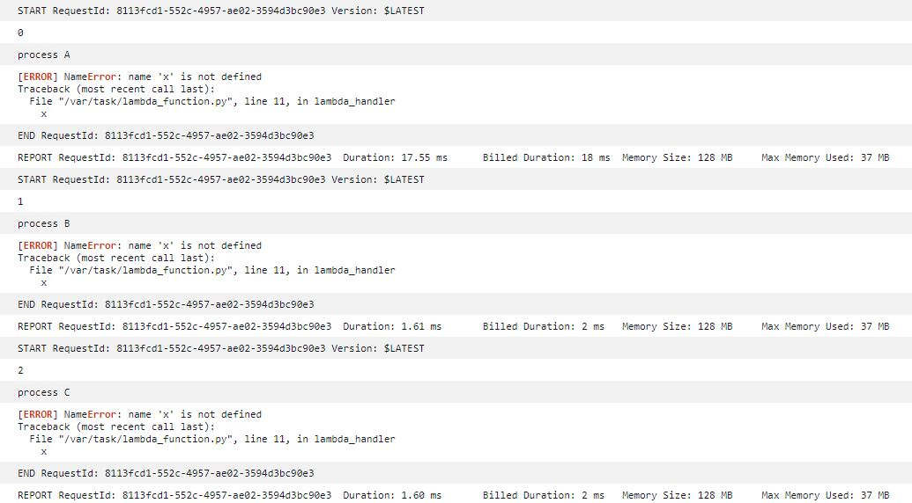

<!--
title:   AWS Lambdaの再試行回数によって処理を分岐させる方法
tags:    AWS,lambda
id:      14a5573252fd4092e3c2
private: false
-->

業務の都合でAWS Lambdaの処理を再試行回数によって分岐させる必要が出てきたので、その実装を含めシェアします。

# 実現できることのイメージ
※Lambdaは最大2回まで再試行を設定可能です。

```Java
if (再処理回数 == 0) {
    // 処理A
} else if (再処理回数 == 1) {
    // 処理B
} else {
    // 処理C
}
```

# とりあえず考えられる方法
基本的に以下の方法は **「Lambdaが再試行されるときはリクエストIDが同じになるのでそれをどうカウントするか」** という考え方が基になっています。

なお、リクエストIDはUUIDっぽいので、他のリクエストIDとは被ることはないという前提です。

- CloudWatch Logsのログを読み取ってリクエストIDをカウントする ([参考](https://zenn.dev/shimo_s3/articles/c2895880138d19))
- DynamoDBなどのDBに記録しつつそれを読み取ってリクエストIDをカウントする ([参考](https://zenn.dev/shimo_s3/articles/c2895880138d19))
- S3にリクエストIDを含んだ名前の空ファイルを吐き、その数をカウントする
- **/tmpにリクエストIDを含んだ名前の空ファイルを吐き、その数をカウントする**

...など

これらの中でも一番下の方法は **「最小限の権限で」「最小限のリソースで」** この実装を行えるため、この方法を試してみます。なお、他の方法は余計な管理や権限付与が発生しますが、こちらの方法については権限が厳しい環境でも実現可能です。

# 実装
やることとしてはリクエストIDを受け取って/tmp内に空ファイルを吐き出すだけなので、おそらくどのランタイムでも実装できそうです。

とりあえず慣れているのでPython 3.9の環境の例を示します。

```Python
import json
import pathlib
from datetime import datetime
from glob import glob


def lambda_handler(event, context):
    aws_request_id = context.aws_request_id
    try:
        # 意図的に失敗させる
        x
    except Exception as e:
        # 再試行回数をprint
        print(count_tmpfile(aws_request_id))
        if count_tmpfile(aws_request_id) == 0:
            print('process A')
            make_tmpfile(aws_request_id)
            raise
        elif count_tmpfile(aws_request_id) == 1:
            print('process B')
            make_tmpfile(aws_request_id)
            raise
        else:
            print('process C')
            raise

    return {
        'statusCode': 200,
        'body': json.dumps('Hello from Lambda!')
    }

def make_tmpfile(request_id):
    now = datetime.now().strftime('%Y%m%d%H%M%S%f')
    tmpfilepath = pathlib.Path(f'/tmp/{request_id}_{now}')
    tmpfilepath.touch()
    return None

def count_tmpfile(request_id):
    return len(glob(f'/tmp/{request_id}_*'))
```

以下はS3のPUTトリガーで起動してみたときのログです。



こんな感じで再処理回数によって処理を分岐させたいときは参考にしてください。